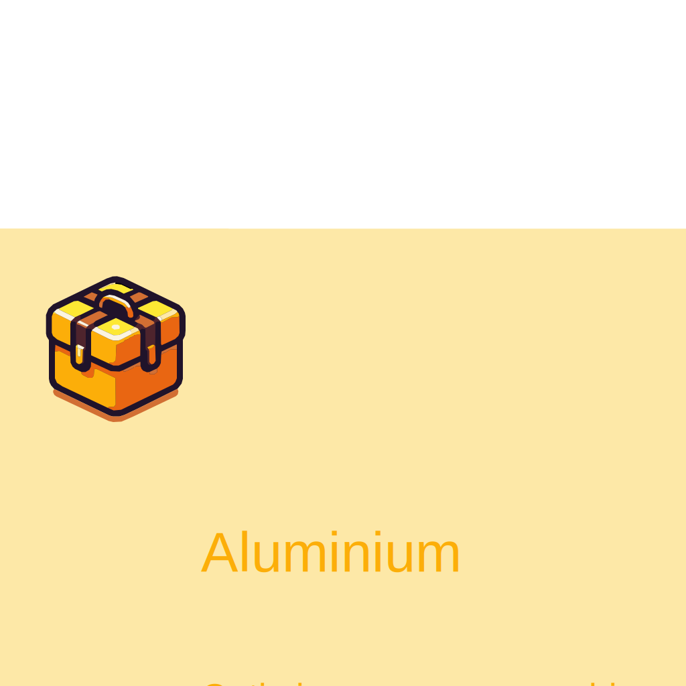

# Aluminium


<p align="center">
  
</p>

Aluminium is a complex project made for extrem compression of folders and backup creation. The goal of Aluminium is low disk space usage, not about taking less CPU and RAM ressources possible, so use it only to make archives and backup not to data flow into the web.


> [!WARNING]
> **Aluminium is a work in progress and currently non-functional. I'm actively developing the core tools it will rely on. Stay tuned!**

## Feature
- No-loss algorithms integration.
- With-loss algorithms intergation.
- Automatic selector for the best algorithm for a specific directory.
- Complete ignoring system and encrypting system to secure some part of a archive.
- Simple, easily runneable on NAS server.
- Powerfull configuration system.
- Rust written (so theorically memory safe and fast)

## How does it work ?
Aluminium use multiple layers of compressing algorithms to perform powerfull optimization.

### 1. With-loss layer (optional)
The first layer of optimization **is optional**, it's the **with-loss compression**. Here the goal is to optimize files with-loss.
> NOTE: When you use a with-loss algorithme, after compressing you files there are neither possibility to get the decompressed file without losing partial fragements of data. For example, when you compress a PNG to JPEG file.

### 2. Encoding table reformater
The second layer is the custom encoding table manage. You see here Aluminium will attempt to generate new custom encoding table without symbols who don't is used such as `Ж` who is a cyrilic character. The new encoding table will be save into a custom `.table.alu` file. So Aluminium will scan the totality of anything you want to optimize and search if one of this option is the best :
    - Keeping the default encoding (never choose in pratic)
    - Using a new encoding table for all your folders.
    - Using new encoding table for one or more folders.
    - Using a encoding for one or more files.

### 3. Compression by method   
The third layer use the first "compress algorithm". Here aluminium will use is scan of his folders or files to compress and we try to optimize it using famous algorithms such as LZ77, LZ78, ZZMA, Huffman, BWT, PPM, FLAC, ect, ...

### 4. `.alu` Assemble
The four layer is consacreate to concatenate all the differents informations and data of you optimized project, you will have : `.table.alu` files, `.alu.json(c)` configurations, metadata of the file and the concrete data store to optimize the most space. #TODO: The will be a complete file about the `.alu` into the documentation.

## Compilling
Aluminium is Rust based so you need to have `cargo` installed and run :
```bash
cargo build --release
```
This will compile for you system the project as a executable.

## 📘 Documentation
There is a custom documentation of this project, please read it before using Aluminium, it's a vast tool.

## ⚖️ Licence
Under [GPL 3.0](./licence.md).

This means you are free to:
- **Use** the software for any purpose.
- **Study and modify** the source code.
- **Distribute** original or modified versions.
- **Sell** the software, provided the terms of the GPL are respected.

However, you must also:
- **Include the full source code** (or offer access to it) when distributing the software.
- **Preserve the GPL 3.0 licence** in all copies or derivative works.
- **Clearly state any changes** you’ve made if you distribute a modified version.
- **Allow recipients to use, modify, and redistribute** your version under the same license.

You may charge for the software or related services (e.g., support, hosting), but you **cannot prevent redistribution** by your users.

For more details, refer to the official [GPL v3 license text](./licence.md).